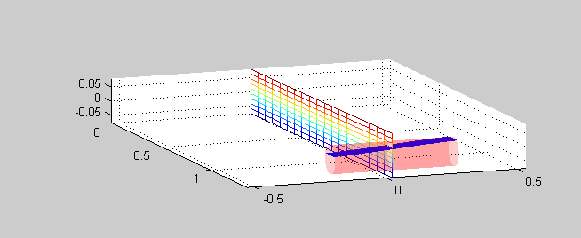
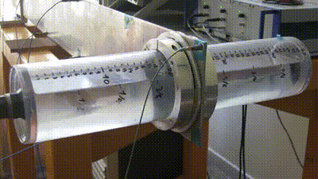
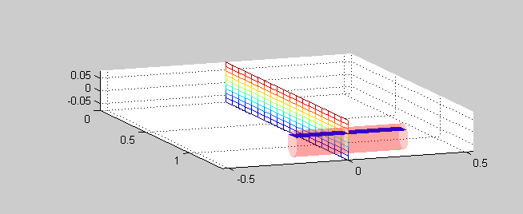
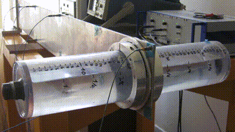
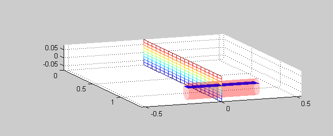
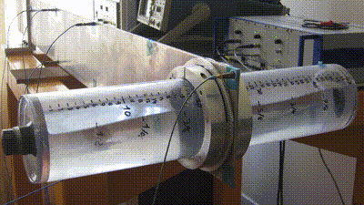
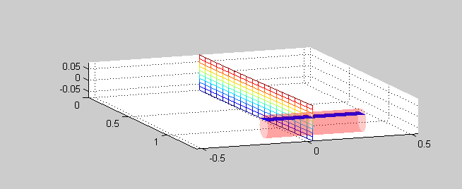

Modeling of a fluid-structure coupled system using port-Hamiltonian formulation
==========

Partial numerical results from our research of port-Hamiltonian systems are presented here.
These results were obtained using the method proposed in our paper submitted to 
IFAC workshop LHMNLC 2015. This project is part of [ANR HAMECMOPSYS](https://hamecmopsys.ens2m.fr/).

All the main functions are in the folder `.\main\`. The following functions implement 
each of the subsystems using the port-Hamiltonian formulation presented in the
paper. The output of these functions is a structure object with matrix J, Q  and B
as elements:

- `.\main\eulerbernoulli.m`: mixed finite-element of Euler-Bernoulli (bending) beam equation;
- `.\main\torsion.m`: mixed finite-element of torsion equation;
- `.\main\rotsaintvenant.m`: mixed finite-element shallow water equations under rotations;
- `.\main\rb.m`:  one-dimensional rigid body (mass/inertia only);

In addition:
- `.\main\phcat.m` can be used to concatenate two port-Hamiltonian subsystems;
- `.\main\couplefullsystem.m`: couple the full system and finds the matrices J, Q, B, D of the
							   global concatenated system, as well as the M, N constraints,
							   E and A of descriptor state-space system representation;
- `.\main\plotfull.m`: make a 3d plot of the full system, given the state vector and system parameters;

In addition to these previous files, scripts from `.\` manipulate the previous main functions
to find numerical results, which are used to validate the approach.
These files are presented in the following subsections.

Euler-Bernoulli beam
------------------------------

As a simple example, the following code allows to find the eigenvalues of Euler-Bernoulli beam
with fixed-free boundary conditions, using N elements:

	eb = eulerbernoulli(N);
	A = eb.J*eb.Q; 
	damp(A)

The following results are obtained using `test_eb.m` file. It finds the first 7 natural frequencies
of the beam for different number of elements and compare them to exact solution
(from `eb_exact.m`). The natural frequencies are given in Hertz.
	
 Number of elements: | 10 | 20 | 40 | 100 | Exact 
 --- | --- | --- | --- | --- | --- 
   | 2.2014 | 2.1962 | 2.1949 | 2.1945 | 2.1944 
   | 14.2932 | 13.8844 | 13.7852 | 13.7576 | 13.7524 
   | 42.8370 | 39.5175 | 38.7555 | 38.5466 | 38.5070 
   | 93.7503 | 79.4293 | 76.4190 | 75.6107 | 75.4583 
   | 182.1092 | 135.9118 | 127.3816 | 125.1547 | 124.7381 
   | 342.2444 | 212.2305 | 192.2890 | 187.2682 | 186.3371 
   | 664.8070 | 313.1929 | 271.9925 | 262.0754 | 260.2559 
   
Torsion beam
--------

Natural frequencies for the fixed-free torsion beam can be obtained exactly as for Euler-Bernoulli
beam. Comparisons to exact solutions can be obtained using 'test_torsion.m'.

Some results:

 Number of elements: | 10 | 20 | 40 | 100 | Exact 
 --- | --- | --- | --- | --- | --- 
   | 35.2771 | 35.2226 | 35.2090 | 35.2052 | 35.2045 
   | 107.6124 | 106.1049 | 105.7359 | 105.6331 | 105.6135 
   | 185.6662 | 178.3201 | 176.5903 | 176.1131 | 176.0226 
   | 274.6805 | 252.8323 | 247.9952 | 246.6802 | 246.4316 
   | 382.8312 | 330.7273 | 320.1805 | 317.3694 | 316.8406 
   | 524.8190 | 413.2809 | 393.3858 | 388.2160 | 387.2497 
   | 731.4576 | 502.0504 | 467.8643 | 459.2557 | 457.6587 
   
Sloshing dynamics
----------------------------------

To validate the sloshing dynamics, let us take into account a stationary tank. The boundary
conditions are given by v(-a/2) = 0, v(a/2) = 0 (zero speed at the boundaries). 
This is equivalent to set u2 = 0 (second input) and y1 = 0 (first output).
In addition, since the tank is still y3 = 0 (no rotation). Check all inputs and
outputs in`rotsaintvenant.m`. 

As a simple example, the following code can be used to find the fluid natural frequencies,
using a descriptor state-space representation (*E Xd = A X*).

	fluid = rotsaintvenant(NUM,FILLING);
	M = [1, 0, 0; 0, 0, 0; 0, 0, 1];
	N = [0, 0, 0; 0, 1, 0; 0, 0, 0];
	A = [fluid.J*fluid.Q, fluid.B;
			M*fluid.B'*fluid.Q,M*fluid.D+N];
	E = eye(NUM*2+2+3);
	E(end-2:end,end-2:end) = 0;
	eig(A,E)
	
File `test_sloshing.m` presents some results and comparison with theoretical exact eigenvalues:

 Number of elements: | 10 | 20 | 40 | 100 | Exact 
 --- | --- | --- | --- | --- | --- 
   | 0.4525 | 0.4539 | 0.4543 | 0.4544 | 0.4544 
   | 0.8939 | 0.9051 | 0.9079 | 0.9086 | 0.9088 
   | 1.3133 | 1.3506 | 1.3600 | 1.3627 | 1.3632 
   | 1.7003 | 1.7878 | 1.8101 | 1.8164 | 1.8176 
   | 2.0455 | 2.2140 | 2.2574 | 2.2696 | 2.2720 
   | 2.3403 | 2.6266 | 2.7012 | 2.7223 | 2.7264 
   | 2.5775 | 3.0229 | 3.1409 | 3.1744 | 3.1808 
   
Rigid body coupled with Euler-Bernoulli beam
----------------------------------------------------
To verify the interconnection structure, we can couple the beam with a tip rigid body
(to represent the tank, for example). Again, we can compare the eigenvalues with
natural frequencies obtained using other methodologies.

The file `test_eb_rb.m` couples a rigid body with rotation inertia and mass, to the
tip of the Euler-Bernoulli flexible structure. It finally finds the coupled system eigenvalues.

 Number of elements: | 10 | 20 | 40 | 100 
 --- | --- | --- | --- | --- | --- 
   | 1.1950 | 1.1935 | 1.1931 | 1.1930 
   | 9.4290 | 9.2845 | 9.2487 | 9.2387 
   | 24.1185 | 23.4024 | 23.2264 | 23.1773 
   | 49.0343 | 45.3344 | 44.4837 | 44.2504 
   | 98.5288 | 83.4842 | 80.3232 | 79.4745 
   | 186.9075 | 139.3455 | 130.5700 | 128.2795 
   | 348.0614 | 215.4729 | 195.1577 | 190.0438 

Rigid body coupled with Torsion beam
--------------------------------------------

Similarly to previous case, the file `test_torsion_rb.m` couples a torsion beam with
a rigid inertia attached at the free-tip. Following natural frequencies are obtained:

 Number of elements: | 10 | 20 | 40 | 100 
 --- | --- | --- | --- | --- | --- 
   | 10.0632 | 10.0626 | 10.0624 | 10.0623 
   | 72.5281 | 72.0690 | 71.9553 | 71.9236 
   | 146.4616 | 142.7677 | 141.8786 | 141.6320 
   | 228.9865 | 215.7573 | 212.7276 | 211.8974 
   | 326.1730 | 291.6944 | 284.3672 | 282.3936 
   | 448.7223 | 371.6749 | 356.9566 | 353.0804 
   | 617.4560 | 457.0766 | 430.7163 | 423.9680 

Full coupled structure dynamics + fluid dynamics
--------------------------------------------------------

All subsystems are coupled in the file `.\main\couplefullsystem.m`. Several tests
with the coupled system can be performed with `coupledFULL.m`. For a given tank FILLING ratio,
specifying the number of elements of each subsystem, this script finds the system natural frequencies.
It also plots the system modal shapes and presents the results of a simple simulation (where the
beam is initially deformed and released at initial time).

The following table shows the natural frequencies of the coupled system, considering the tank 25% filled:

Number of elements: | 10 | 50 | 200 | Ref. previous work
 --- | --- | --- | --- | --- | --- 
Slosh+bending | 0.4318 | 0.4332 | 0.4332  |  0.4362  
Slosh+bending | 1.1404 | 1.1436 | 1.1437  |  1.1938  
Slosh+bending | 1.3690 | 1.4174 | 1.4194  |  1.407   
Slosh+bending | 2.0544 | 2.2770 | 2.2860  |  2.1541  
Slosh+bending   | 2.5799 | 3.1637 | 3.1880  |  2.8618   
   | ... |  ... | ... |   
 1st Torsion  | 8.4273 | 8.4268 | 8.4267 | 9.3078  
 2nd bending  | 8.8955 | 8.7469 | 8.7515 | 9.7317

From the the eigenvectors of each mode, we can find the modal shape. The following animated GIFs
show the first 3 modal shapes (which represent coupled fluid+bending modes).
Each numerically obtained mode are also compared with the experimental
results obtained by exciting the system in the frequencies of these specific modes.
The tank is filling ratio is 75% for all following cases:

1st mode:

2nd mode:

3rd mode:

 

*Remark:* Symmetric sloshing modes were neglected in the previous table. Due to their symmetry, 
they won't interact with structural dynamics (so they are not observable, neither controllable).
The following mode is an example of symmetric one:

Finally, the code can be used for simulation. The following animated GIF shows an example
of simulation. The beam starts at a deformed condition and it is then released:

